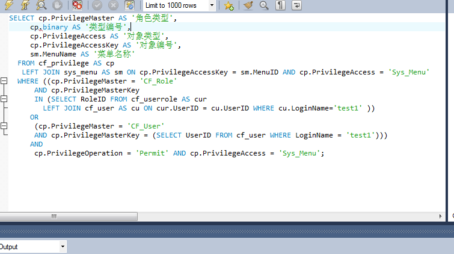
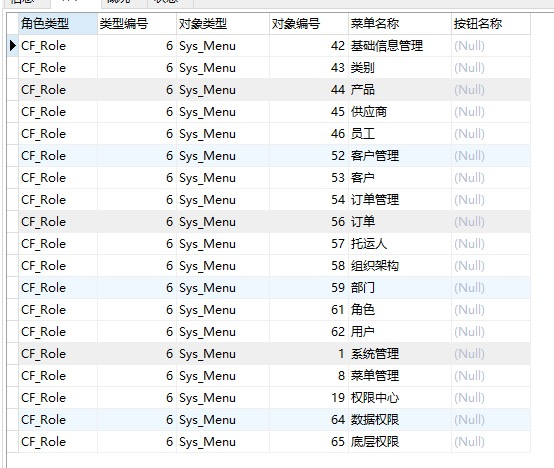
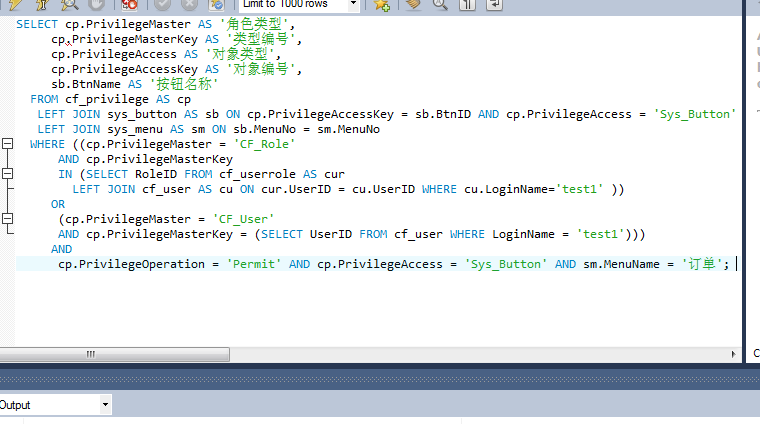
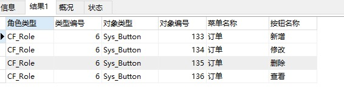

##查询用户test1可以查看的页面（Sys_menu）

##查询结果

##伪代码:
1 根据名称查找人员编号UserID
2 根据人员编号UserID查找改人员所对应的角色集合RoleIDs
3 权限表 LEFT JOIN 页面表并查找
  角色类型为CF_Role   AND   角色编号在角色集合RoleIDs中
   OR
  角色类型为CF_User   AND   人员编号为UserID
   AND
  权限属性为Permit   AND   权限为Sys_Menu的数据
##对订单(order)页面中的操作权限(sys_button)

##查询结果

##伪代码
1 根据名称查找人员编号UserID
2 根据人员编号UserID查找改人员所对应的角色集合RoleIDs
3 权限表 LEFT JOIN 按钮表 LEFT JOIN 页面表并查找
  角色类型为CF_Role   AND   角色编号在角色集合RoleIDs中
   OR
   角色类型为CF_User   AND   人员编号为UserID
   AND 权限属性为Permit   AND   权限为Sys_Button AND 菜单名字为订单的数据

